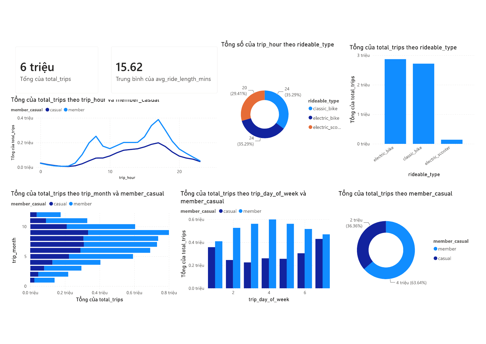

# 🚲 Cyclistic Bike-Share: Phân tích hành vi khách hàng để tăng tỷ lệ chuyển đổi sang Member

**Vai trò:** Data Analyst
**Công cụ:** SQL Server (T-SQL) · Power BI
**Bộ dữ liệu:** 12 tháng dữ liệu chuyến đi năm 2024 (public dataset, mô phỏng công ty xe đạp chia sẻ Cyclistic – Chicago)

### 📌 Tóm tắt nhanh
- **Vấn đề:** Marketing đang phân bổ ngân sách dàn trải cho 2.08 triệu chuyến Casual/năm, không nhắm đúng nhóm dễ chuyển đổi sang Member nhất.
- **Phát hiện chính:** Member đi theo mô hình đi làm rõ rệt (2 đỉnh giờ 8h & 17h); Casual đi dài gấp **1.75 lần** Member (21.75 so với 12.44 phút) và tập trung cuối tuần — nhưng vẫn có lượng đáng kể Casual đi trùng giờ cao điểm ngày thường.
- **Phát hiện phụ đáng chú ý:** scooter điện chỉ chiếm **2.41%** tổng số chuyến — thấp bất thường so với 2 loại xe còn lại.
- **Đề xuất:** 4 hành động cụ thể có cách đo lường thành công riêng. 

---

## 1. Bối cảnh & Vấn đề kinh doanh (Ask)

Cyclistic vận hành dịch vụ chia sẻ xe đạp với hai nhóm khách hàng:

- **Member**: mua gói thành viên theo năm, giá ổn định, biên lợi nhuận cao và bền vững.
- **Casual**: mua vé lượt/vé ngày, giá cao hơn trên mỗi phút sử dụng nhưng không tạo doanh thu định kỳ.

**Vấn đề đội Marketing đang gặp:** đội ngũ tài chính của Cyclistic đã kết luận rằng khách **Member có giá trị vòng đời (LTV) cao hơn đáng kể** so với khách Casual. Tuy nhiên, ngân sách marketing hiện tại đang được phân bổ dàn trải, không nhắm đúng vào nhóm khách Casual có khả năng chuyển đổi cao nhất.

**Câu hỏi kinh doanh (business task):**
> Khách hàng Member và Casual sử dụng xe đạp khác nhau như thế nào, và Marketing nên thiết kế chiến dịch nhắm mục tiêu vào đâu (thời điểm, địa điểm, loại xe) để chuyển đổi Casual thành Member với chi phí hiệu quả nhất?

---

## 2. Mục tiêu phân tích

1. Định lượng sự khác biệt trong **hành vi sử dụng** (thời gian trong ngày, ngày trong tuần, tháng trong năm, loại xe) giữa hai nhóm khách.
2. Xác định **cửa sổ thời gian và bối cảnh sử dụng** mà khách Casual gần giống hành vi "đi làm" nhất của Member — đây là nhóm dễ chuyển đổi nhất vì đã có nhu cầu sử dụng lặp lại.
3. Đưa ra khuyến nghị chiến dịch cụ thể (thời điểm, kênh, thông điệp) thay vì khuyến nghị chung chung "tăng ưu đãi cho Casual".

---

## 3. Giả thuyết ban đầu (Hypothesis)

Trước khi phân tích, tôi đặt ra 3 giả thuyết dựa trên hiểu biết chung về hành vi đi lại đô thị:

| # | Giả thuyết | Vì sao đặt ra |
|---|---|---|
| H1 | Member sử dụng xe theo mô hình **đi làm** (2 đỉnh cao điểm sáng ~7-9h và chiều ~16-18h, tập trung ngày thường) | Người có gói thành viên năm thường dùng cho nhu cầu lặp lại, có kế hoạch |
| H2 | Casual sử dụng xe theo mô hình **giải trí** (tập trung cuối tuần, buổi trưa/chiều, thời lượng chuyến dài hơn) | Vé lượt phù hợp với nhu cầu không thường xuyên, không bị áp lực chi phí theo phút như đi làm |
| H3 | Có một nhóm nhỏ Casual đi vào khung giờ cao điểm ngày thường — đây là "Casual tiềm năng chuyển đổi" vì hành vi của họ đã giống Member | Đây là nhóm khách "gần chuyển đổi nhất", chi phí marketing để thuyết phục họ thấp hơn nhóm Casual thuần giải trí |

---

## 4. Quá trình xử lý & kiểm chứng bằng dữ liệu (Prepare → Process → Analyze)

### 4.1. Prepare — Chuẩn bị dữ liệu
- Nguồn: 12 file dữ liệu chuyến đi theo tháng (định dạng chuẩn của Divvy/Cyclistic), tổng hợp trong SQL Server.
- Đánh giá độ tin cậy: dữ liệu do bên cung cấp hệ thống ghi nhận trực tiếp (không qua khảo sát) → độ tin cậy cao, nhưng cần làm sạch vì có bản ghi lỗi hệ thống (trạm bảo trì, GPS lỗi).

### 4.2. Process — Làm sạch & biến đổi dữ liệu
Toàn bộ pipeline nằm trong [`sql_queries/Cyclistic_Data_Preparation.sql`](./sql_queries/Cyclistic_Data_Preparation.sql), gồm 4 bước:

1. **Gộp dữ liệu**: UNION ALL 12 bảng tháng thành `all_trips_2024_raw`.
2. **Làm sạch**:
   - Loại bản ghi trùng `ride_id` (dùng `ROW_NUMBER()` để giữ bản ghi có đủ tên trạm).
   - Loại chuyến có `started_at >= ended_at` (lỗi đồng bộ thời gian).
   - Loại chuyến **dưới 60 giây** — đây thường là thao tác test/lỗi khóa xe của nhân viên bảo trì, không phải chuyến đi thật, nếu giữ lại sẽ làm lệch chỉ số thời lượng trung bình.
   - Loại bản ghi thiếu tọa độ kết thúc (`end_lat`/`end_lng` NULL) — không dùng được cho phân tích trạm.
3. **Làm giàu dữ liệu**: tính `ride_length_minutes`, tách `trip_month`, `trip_day_of_week`, `trip_hour` để phục vụ phân tích theo thời gian.
4. **Tổng hợp**: GROUP BY theo `member_casual`, `rideable_type`, `trip_month`, `trip_day_of_week`, `trip_hour` → xuất bảng `Cyclistic_Summary_PowerBI` — giảm hàng triệu dòng chi tiết xuống bảng tổng hợp gọn, tăng tốc độ tải Power BI.

**Vì sao xử lý theo hướng này:** thay vì import thẳng dữ liệu thô vào Power BI (nặng, chậm, dễ sai do dữ liệu bẩn), tôi đẩy toàn bộ phần làm sạch và tổng hợp xuống tầng SQL — đúng nguyên tắc "xử lý càng gần nguồn càng tốt", giúp dashboard chỉ tập trung vào trực quan hoá.

### 4.3. Analyze — Kết quả kiểm chứng giả thuyết

> Toàn bộ số liệu trong mục này được truy vấn và xác minh trực tiếp từ SQL Server (xem [`sql_queries/data_validation_checks.sql`](./sql_queries/data_validation_checks.sql)).



**Diễn giải dashboard:**
- **Tổng của total_trips (6 triệu)**: tổng số chuyến đi năm 2024 sau khi làm sạch dữ liệu.
- **Trung bình của avg_ride_length_mins (15.62 phút)**: thời lượng trung bình mỗi chuyến. Tách theo nhóm: Member 12.44 phút, Casual 21.75 phút — Casual đi dài gấp ~1.75 lần Member.
- **Tổng của total_trips theo rideable_type** (biểu đồ cột): electric_bike và classic_bike chiếm phần lớn số chuyến, electric_scooter chỉ chiếm 2.41% — gần như không đáng kể.
- **Tổng của total_trips theo trip_hour và member_casual** (biểu đồ đường): Member có hình chữ M với 2 đỉnh rõ rệt lúc 8h và 17h, đặc trưng cho mô hình đi làm. Casual tăng thoải hơn và chỉ có 1 đỉnh vào buổi chiều, đặc trưng cho mô hình giải trí.
- **Tổng của total_trips theo trip_month** (biểu đồ cột ngang): thấp nhất vào các tháng đầu/cuối năm (mùa đông), cao nhất giữa năm (mùa hè/thu) — tính mùa vụ ảnh hưởng đều lên cả 2 nhóm khách.
- **Tổng của total_trips theo trip_day_of_week** (biểu đồ cột): Member cao nhất giữa tuần (Thứ Tư), thấp nhất cuối tuần (Thứ Bảy); Casual ngược lại, thấp nhất giữa tuần (Thứ Ba), cao nhất Thứ Bảy. Trục X đánh số theo quy ước `@@DATEFIRST` của SQL Server (1 = Chủ Nhật).
- **Tổng của total_trips theo member_casual** (donut): Member 63.64%, Casual 36.36%.

**Tổng quan:** 5,721,907 chuyến đi trong năm 2024, sau khi làm sạch.

| Chỉ số | Kết quả thực tế | Đối chiếu giả thuyết |
|---|---|---|
| Tỷ trọng Member / Casual | **63.64% (3,641,445)** / **36.36% (2,080,462)** | Member chiếm đa số nhưng Casual vẫn ~2.08 triệu chuyến — quy mô đủ lớn để đầu tư chiến dịch |
| Thời lượng chuyến trung bình (weighted) | Member **12.44 phút** / Casual **21.75 phút** / Chung **15.83 phút** | ✅ Casual đi trung bình **dài gấp ~1.75 lần** Member — phù hợp mục đích giải trí thay vì di chuyển điểm-điểm |
| Phân bố theo giờ (`trip_hour`) | Member có **2 đỉnh rõ rệt: 8h (251,370 chuyến) và 17h (386,771 chuyến)**, hình chữ M; Casual có 1 đỉnh rộng, tăng dần và đạt đỉnh cùng lúc 17h (197,705 chuyến) nhưng không có đỉnh sáng | ✅ Xác nhận **H1 và H2**: Member = mô hình đi làm rõ rệt, Casual = mô hình linh hoạt/giải trí |
| Phân bố theo ngày trong tuần | Casual thấp nhất giữa tuần (T3: 225,515), tăng dần và đạt đỉnh **Thứ Bảy (429,467)**; Member cao nhất **Thứ Tư (599,462)**, thấp nhất **Thứ Bảy (469,486)** | ✅ Củng cố mạnh **H2** — hai nhóm gần như đối lập theo ngày trong tuần |
| Phân bố theo tháng | Thấp nhất Tháng 1 (~140k), cao nhất Tháng 9 (~800k) | Yếu tố thời tiết/mùa ảnh hưởng đến cả 2 nhóm tương tự nhau, không phải yếu tố phân biệt hành vi giữa 2 nhóm |
| Loại xe sử dụng | electric_bike **50.16%** (2,869,311), classic_bike **47.45%** (2,714,984), electric_scooter chỉ **2.41%** (137,612) | ⚠️ Phát hiện ngoài dự kiến: scooter điện gần như không được sử dụng — xem khuyến nghị #4 |

**Về H3** (nhóm Casual đi giờ cao điểm ngày thường): dữ liệu theo giờ xác nhận vẫn có một lượng đáng kể chuyến Casual rơi vào khung 7-9h (52,164–73,847 chuyến) và 16-18h (168,232–197,705 chuyến) — thấp hơn khung chiều/tối nhưng không hề nhỏ. Đây chính là phân khúc mục tiêu cho khuyến nghị #1 bên dưới.

**Giới hạn dữ liệu:**
- Vì bảng tổng hợp không giữ `ride_id` hoặc thông tin trạm ở cấp chi tiết, chưa thể định lượng chính xác bao nhiêu % Casual đi giờ cao điểm ngày thường là *lặp lại nhiều lần* (dấu hiệu "đi làm bằng Casual" thực sự) — đây là hướng phân tích tiếp theo ở phần Act.
- Phát hiện **375 chuyến (~0.007% tổng số)** có thời lượng trên 24 giờ trong bảng chi tiết — bước cleaning gốc chỉ lọc ngưỡng dưới (`>= 60 giây`) mà chưa có ngưỡng trên. Tỷ lệ quá nhỏ để ảnh hưởng đến kết luận, nhưng cần bổ sung `WHERE ride_length_minutes <= 1440` vào pipeline nếu tái sử dụng cho phân tích khác.
- `trip_day_of_week` phụ thuộc cấu hình `@@DATEFIRST` của SQL Server (ở đây = 7, tức **1 = Chủ Nhật**). Đã đối chiếu và map lại đúng nhãn ngày trước khi kết luận, tránh sai lệch thông điệp "cuối tuần".

---

## 5. Đề xuất hành động (Share & Act)

| Đề xuất | Cơ sở dữ liệu | Cách đo lường thành công |
|---|---|---|
| **1. Chiến dịch "Chuyển đổi giờ cao điểm"**: gửi ưu đãi nâng cấp Member cho các tài khoản Casual có ≥3 chuyến trong khung 7-9h/16-18h ngày thường trong 30 ngày | Nhóm này hành vi giống Member nhất → chi phí thuyết phục thấp, tỷ lệ chuyển đổi kỳ vọng cao hơn quảng cáo đại trà | Theo dõi tỷ lệ chuyển đổi nhóm được target vs. nhóm đối chứng (A/B test) trong 60 ngày |
| **2. Gói "Weekend Membership" hoặc combo tuần**: vì phần lớn Casual dùng xe cuối tuần, một gói thành viên linh hoạt (giá thấp hơn Member năm nhưng cao hơn vé lượt) có thể là bước đệm chuyển đổi | Dữ liệu cho thấy nhu cầu cuối tuần của Casual rất ổn định, không phải ngẫu nhiên | So sánh doanh thu/khách trước và sau khi ra gói mới |
| **3. Ưu đãi tại trạm gần khu văn phòng vào giờ cao điểm** | Trùng khớp với khung giờ Member hoạt động mạnh nhất | Theo dõi số lượt quét mã ưu đãi và tỷ lệ đăng ký Member mới tại các trạm này |
| **4. Rà soát lại đội xe scooter điện**: đề xuất bộ phận vận hành đánh giá chi phí duy trì đội scooter so với nhu cầu thực tế trước khi mở rộng chiến dịch marketing cho loại xe này | Scooter điện chỉ chiếm **2.41%** tổng số chuyến (137,612/5.72 triệu) — thấp hơn nhiều so với classic_bike và electric_bike vốn đang chia nhau ~50/50 | So sánh chi phí vận hành/chuyến giữa 3 loại xe; nếu scooter có chi phí cao hơn đáng kể trên mỗi chuyến, cân nhắc tái phân bổ ngân sách sang electric_bike |

**Bước tiếp theo nếu có thêm dữ liệu:** truy vấn ở cấp độ `ride_id` (chưa tổng hợp) để tính tần suất lặp lại theo từng khách Casual ẩn danh — từ đó xây mô hình phân loại "Casual có khả năng chuyển đổi cao" thay vì chỉ dừng ở phân tích mô tả (descriptive) như hiện tại.

---

## 📁 Cấu trúc project
```
├── sql_queries/
│   ├── Cyclistic_Data_Preparation.sql    # Pipeline gộp - làm sạch - tổng hợp dữ liệu
│   └── data_validation_checks.sql        # Bộ kiểm tra chất lượng dữ liệu trước khi build dashboard
├── dashboards/
│   ├── cyclistic.pdf                     # Dashboard Power BI gốc
│   └── cyclistic_dashboard.png           # Ảnh xuất để nhúng trong README
└── README.md
```
